# Modul Praktikum Pemrograman Web

## Praktikum 1: HTML Dasar

Nama: Fadhil Syafiq Abdullah 
NIM: 312510161 
Kelas: I251B 
Mata Kuliah: Pemrograman Web
---

### 1. Membuat Title Praktikum HTML Dasar

Pada tahap ini dibuat struktur dasar HTML dan ditambahkan tag <title> untuk memberikan judul pada halaman web.
Code:  
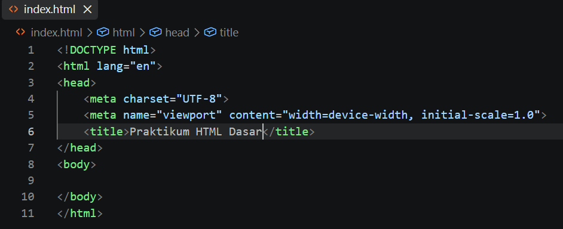
Output:  
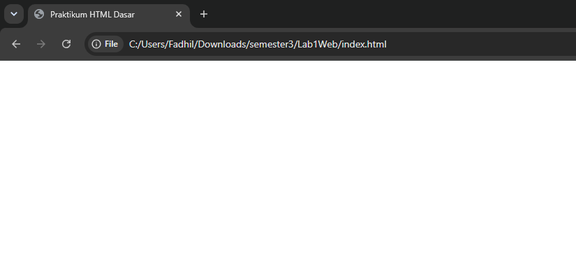

### 2. Membuat Paragraf

Pada tahap ini dibuat beberapa paragraf menggunakan tag 
 untuk menampilkan teks pada halaman web.
Code:  
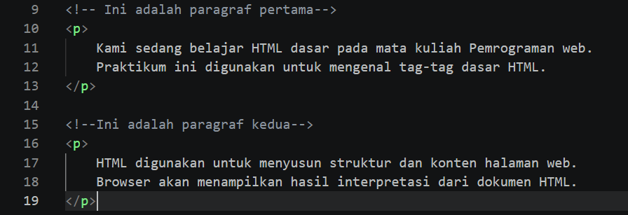
Output:  
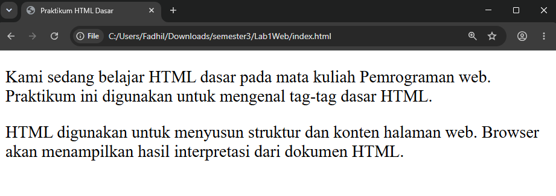

### Menambahkan Judul

Pada tahap ini ditambahkan heading menggunakan tag <h1> dan <h2> sebagai judul utama dan subjudul pada halaman web.
Code:  
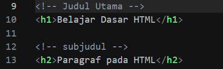
Output:  
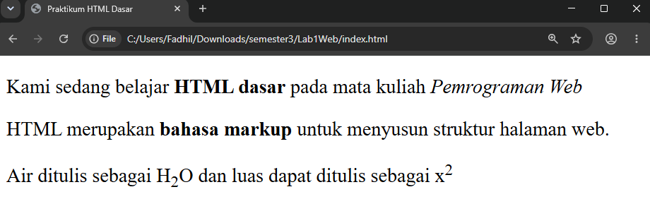

### Memformat Teks

Pada tahap ini dilakukan pemformatan teks menggunakan beberapa tag HTML seperti <b>, <i>, <strong>, , dan .
Code:  
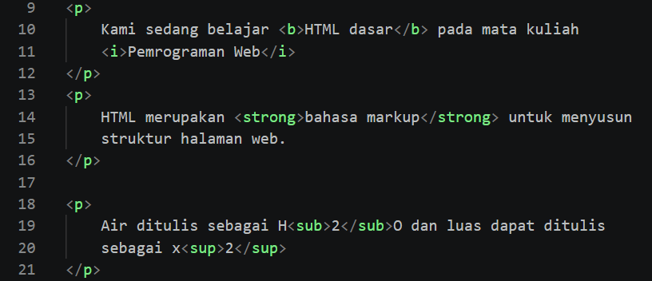
Output:  

### Menyisipkan Gambar

Pada tahap ini ditambahkan heading dan gambar menggunakan tag <h3> dan . Atribut src digunakan untuk menentukan lokasi gambar.
Code:  
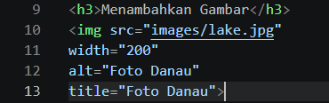
Output:  
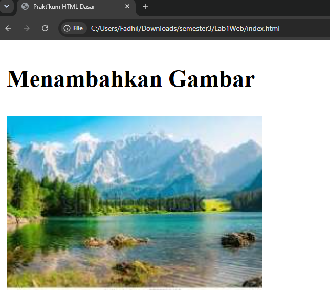

### Mengatur Ukuran Gambar

Pada tahap ini ukuran gambar diatur menggunkan atribut width dan height untuk menyesuaikan tampilan gambar pada halaman web.
Code:  
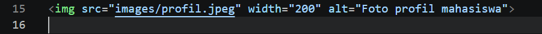
Output:  
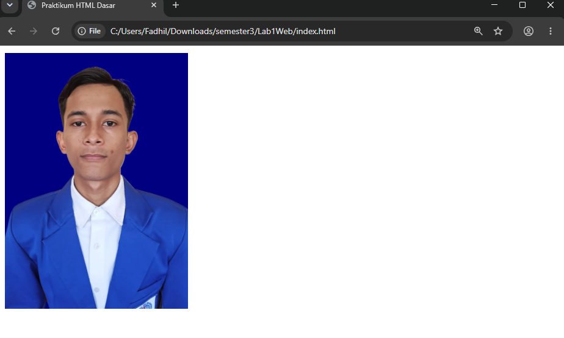

### Menambahkan Hyperlink

Pada tahap ini dibuat hyperlink menggunakan tag <a> dan atribut href untuk menghubungkan halaman HTML dengan halaman lain atau website eksternal.
Code:  
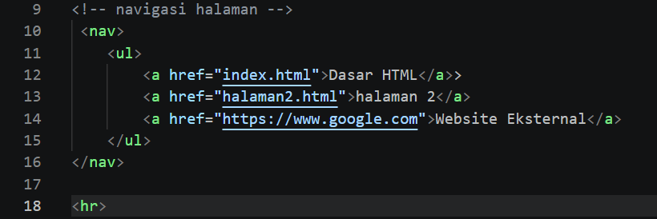
Output:  
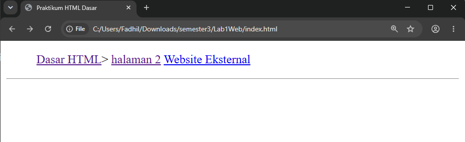

### Menambahkan List

Pada tahap ini dibuat daftar menggunakan unordered list <ul> dan ordered list <ol> dengan elemen <li>
Code:  
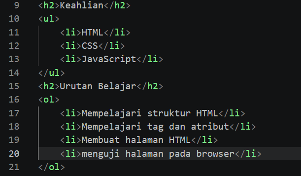
Output:  
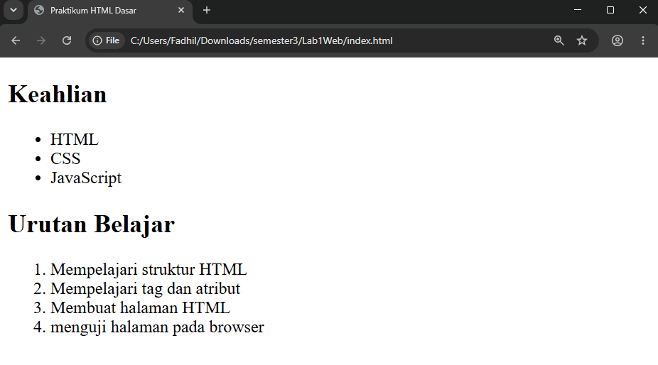

### Menambahkan Komentar

Pada tahap ini ditampilkan komentar HTML menggunakan <!-- bagian profil mahasiswa -->. Komentar tidak ditampilkan pada browser dan digunakan sebagai penanda atau keterangan pada kode.
Code:  
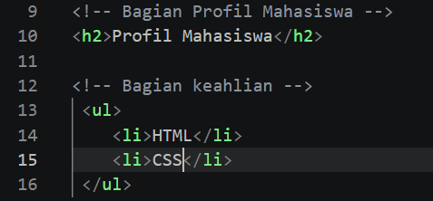
Output:  
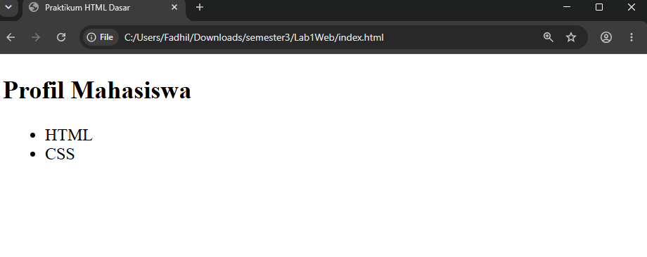

### Menggabungkan Semua Elemen

Pada tahap terakhir, seluruh elemen HTML yang telah dipelajari digabungkan menjadi satu halaman Profil Mahasiswa yang terdiri dari Hyperlink, heading, gambar, paragraf, list, dan elemen lainnya.
Code:  
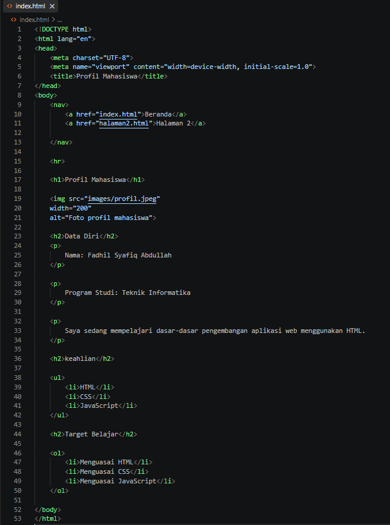
Output:  
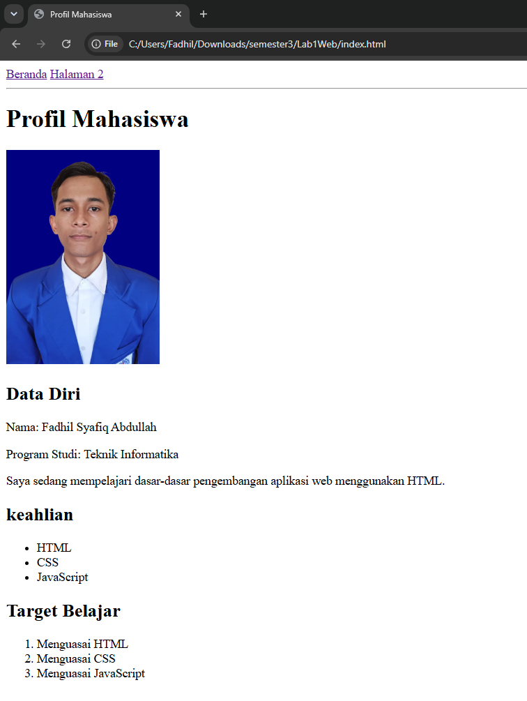

